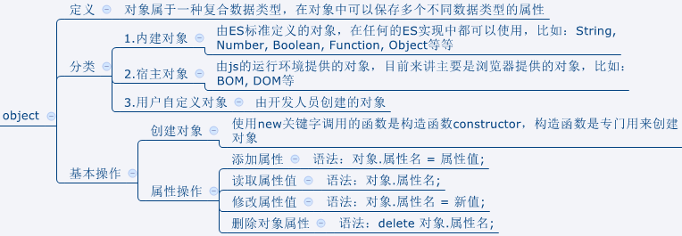

# JavaScript笔记

## 应用方式

| 应用方式         | 含义                                            |
| ---------------- | ----------------------------------------------- |
| 内联（内嵌）样式 | <head>内通过<script>编写                        |
| 行内样式         | 普通标签结合onclick事件属性，或超链接的href属性 |
| 外部样式         | <script>中使用src引入                           |

```html
<head>
    <!--1.内联方式-->
    <script>
        alert("Hello JavaScript"); // 弹出一个窗口
    </script>
    <!--3.引用外部的js文件-->
    <script src="js/hello.js"></script>
</head>
<body>
    <!--2.行内方式-->
    <input type="button" value="点我" onclick="alert('hello')">
    <div onmouseover="alert('走开！')">把鼠标移上来！</div>
    <a href="javascript:alert('超链接被触发')">我是超链接</a>
</body>
```

## 基本用法

### 变量

```javascript
var 变量名=变量值;
let 局部变量=变量值;
```

### 转义符

| 符号 | 含义   |
| ---- | ------ |
| \n   | 换行   |
| \t   | 缩进   |
| \\"  | 双引号 |
| \\'  | 单引号 |

### 输入输出

| 方法             | 含义         |
| ---------------- | ------------ |
| alert()          | 弹出警告框   |
| console.log()    | 输出到控制台 |
| document.write() | 输出到页面   |
| prompt()         | 弹出输入框   |

### 数据类型转换

| 方法                               | 含义          |
| ---------------------------------- | ------------- |
| Number()、parseInt()、parseFloat() | 转化为number  |
| 拼接空字符串                       | 转化为string  |
| Boolean()                          | 转换为boolean |

### Math对象

用法：Math.方法名(参数)

| 方法                       | 含义                     |
| -------------------------- | ------------------------ |
| Math.abs(-5)               | 绝对值                   |
| Math.pow(2, 4)             | 次方                     |
| Math.round(3.5)            | 四舍五入                 |
| Math.ceil(3.5)、floor(3.5) | 向上、向下取整           |
| Math.random()              | 生成0到1之间的随机浮点数 |
| Math.max(1, 3 ,5)、min()   | 最大、最小值             |
| Math.PI                    | 圆周率                   |

### 循环结构

while、do...while、for、**for...in**

break、continue

```javascript
var str='welcome'; // 可以将字符串看作是由多个字符组成的集合
for(var index in str){
  // index表示集合中元素的索引，并不是元素本身
  console.log(str[index]);
}
```

### 数组


```js
var arr = new Array();
var arr = new Array(1,3,...);
var arr =[2,4,...];
```

| 方法                  | 描述                                     |
| --------------------- | ---------------------------------------- |
| arr.length            | 数组长度                                 |
| arr.sort(compareFn)   | 按字符编码顺序排序，可以传入比较规则函数 |
| arr.reverse()         | 将数组中元素倒序排序                     |
| arr.join(',')         | 使用指定分隔符连成字符串                 |
| arr.toString()        | 将数组转换为字符串，逗号连接             |
| arr.indexOf()         | 返回指定元素首次出现的位置               |
| arr.slice(begin, end) | 截取从begin到end 的子数组                |
| arr.forEach(show)     | 对每一个元素执行show函数                 |

```js
/*
* arr.sort的compareFn函数
* 若返回值为正数，则传入的两者互换位置
*/
function compareFn(a,b){
    return a-b;
}
//arr.forEach的show函数
function show(value, index){
  console.log(value, index);
}
arr.forEach(show);
```

## 函数

### 自定义函数

```js
function 函数名(参数1, 参数2,...){
	//函数体
}
```

-   实参个数和形参个数可以不同
-   参数类型、返回值不需要指定
-   默认返回undefined

### 回调函数

#### 作为事件绑定的函数

```html
<script>
  function f1(){
  console.log(111);
}
// 点击页面时执行函数f1
window.onclick=f1;  // 回调函数，即回头调用此函数，不能加小括号
</script>
```

#### 作为另一个函数的参数

数组中**arr.sort(compareFn)**和**arr.forEach(show)**中的compareFn和show函数，均是回调函数

### 匿名函数

#### 用于函数的回调

```js
window.onclick=function(){
  console.log('点击了页面');
}
//使用箭头函数
window.onclick=() => {
  console.log(1111);
};
```

#### 自执行函数

```js
(function(){
	console.log('只执行一次');
})()
```

### 箭头函数

语法： (参数) => {返回值}

又称lambda表达式，是一种特殊的匿名函数

```js
// 示例1
var a = function(x){
  return x*2;
}
var a = x => x*2; // 更简洁

// 示例2：如果箭头函数没有参数或有2个以上参数，则必须使用小括号表示参数部分
var a = function(x,y){
  return 5;
}
var a = (x, y) => 5;

// 示例3：如果箭头函数的函数体多于一条语句，则必须使用大括号将它们括起来
var a = function (x, y) {
  var sum = x + y;
  return sum
}
var a = (x,y) => {
  var sum = x + y;
  return sum;
}
```

## 复合类型

### String 字符串

```js
var str = 'welcome';							// 基本数据类型string
var str = new String('welcome');	// 引用数据类型String
```

| 方法                  | 描述                               |
| --------------------- | ---------------------------------- |
| charAt()              | 返回某位置的字符                   |
| replace('old', 'new') | 用new替换old                       |
| indexOf()             | 查询某个值首次出现的位置           |
| lastindexOf()         | 查询某个值最后出现的位置           |
| toLowerCase()         | 转化为小写                         |
| toUpperCase()         | 转化为大写                         |
| substring(start, end) | 提取子串                           |
| split(' ', 3)         | 以' '为间隔，分割为3个字符串的数组 |
| trim()                | 去除前后两端的空格                 |

### Date

```js
var date = new Date(); // 定义一个日期对象，表示当前时间 
var date = new Date(year,month,day,hour,minute,second) // 参数为指定的年、月、日、时、分、秒 
var date = new Date(millSeconds); //参数为与1970-1-1相差的毫秒数
```

| 方法名            | 说明                                   |
| ----------------- | -------------------------------------- |
| getFullYear()     | 以四位数字返回年份                     |
| getMonth()        | 返回月份(0~11)，0表示1月               |
| getDate()         | 返回一个月中的某一天(1~31)             |
| getHours()        | 返回小时 (0 ~ 23)                      |
| getMunutes()      | 返回分钟 (0 ~ 59)                      |
| getSeconds()      | 返回秒数 (0 ~ 59)                      |
| getMilliseconds() | 返回毫秒(0 ~ 999)                      |
| getDay()          | 返回一周中的某一天(0~6)，**0表示周日** |
| getTime()         | 返回从1970­1­1 0:0:0至今的毫秒数       |

setXxx方法与getXxx方法类似，用于设置对应的值

### JSON

JavaScript **Object** Notation 是一种轻量级的数据交换格式，用于表示JavaScript对象的一种方式

```js
//JSON转化为字符串
var person={ 
  "name":"汤小洋", 
  "age":18, 
  "height":180.5 
}; 
var str=JSON.stringify(person);

//字符串转化为JSON
var str='{"name":"tom","age":20}'; 
var obj=JSON.parse(str);

var users='[
	{"id":1,"username":"admin","password":"123"},
	{"id":2,"username":"tom","password":"456"} 
]'; 
var objs=JSON.parse(users);
```

### 对象类型



### 创建对象的方法

-   使用Object

```js
// 新创建的对象没有属性和方法 
var 对象名=new Object(); 
// 为对象添加属性 
对象名.属性名=属性值; 
// 为对象添加方法 
对象名.方法名=function(){ 
  方法体 
}

// 调用属性和方法 
对象名.属性名; 或 对象名['属性名']; 
对象名.方法名();
```

```js
var stu=new Object();
// 添加属性
stu.name='tom';
stu.age=18;
stu.height=180.5;
// 添加方法
stu.study=function(){
  console.log('我叫'+stu.name+"，正在学习。。。。");
};
stu.run=function(){
  console.log('正在参加马拉松。。。。');
};

// 调用属性和方法
console.log(stu.name,stu['age']);
stu.study();
stu.run();
```

-   使用构造函数，模拟类的定义，相当于自定义了一个类型

```js
function 构造函数名(形参1,形参2…) { // 为了区别于普通函数，构造函数名建议首字母大写 
  this.属性名=形参1; 
  this.属性名=形参2; 
  this.方法名=function(){ 
    方法体 
  };
}

var 对象名=new 构造函数名(实参1,实参2…);
```

```js
function Student(name,age,sex){
  // 属性
  this.name=name;
  this.age=age;
  this.sex=sex;
  // 方法
  this.show=function(){
    console.log('我叫'+this.name+'，年龄：'+this.age+',性别：'+this.sex);
  };
  this.study=function(){
    console.log('正在学习。。');
  };
}
```

-   使用JSON格式对象，一般只在JSON对象中定义属性

```js
var JSON对象 = { 
  属性名:属性值, // 属性名可以不用引号 
  属性名:属性值,
  ...
};
```

```js
var student={
  "name":"tom",
  "age":18,
  "sex":"male",
  "study":function(){
    console.log("正在学习。。");
  }
};
console.log(student.name,student['age']);
student.study();
```

## DOM操作

Document Object Model：文档对象模型

### 查询操作 

test21查询实例

| 方法或属性 | 含义 |
| ---------- | ---- |
|**document.getElementById("id值")** |根据**id属性**来查询节点，返回匹配的第一个节点 |
|document.getElementsByName("name属性值") |根据**name属性**来查询，返回所有匹配的节点集合 |
|**document.getElementsByTagName("标签名")** |根据**标签名**来查询，返回所有匹配的节点集合 |
|**document.getElementsByClassName("类名")** |根据**类名**来查询，返回所有匹配的节点集合 |
|document.querySelector("选择器") |根据css选择器来查询，返回匹配的第一个节点 |
|document.querySelectorAll("选择器") |根据css选择器来查询，返回所有匹配的节点集合，如根据class名: '.delete' |
|**parentNode属性** |查询当前节点的**父节点**|
|previousSibling属性 |查询当前节点的上一个节点|
|nextSibling属性 |查询当前节点的下一个节点|
|**firstChild属性** |查询当前节点的**第一个子节点**|
|lastChild属性 |查询当前节点的最后一个子节点|

### 访问操作

| 访问对象 | 用法                   | 解释                               |
| -------- | ---------------------- | ---------------------------------- |
| 访问属性 | DOM对象.属性           | 如obj.value                        |
| 访问内容 | DOM对象.innerHTML      | 解析为HTML                         |
| 访问内容 | DOM对象.innerText      | 解析为纯文本                       |
| 访问CSS  | DOM对象.style.样式属性 | 去掉短横线，将其后的单词首字母大写 |
| 访问CSS  | DOM对象.className      |                                    |

### 添加操作

| 方法 | 含义 |
| ----------------------------------- | -------------------------------------------------------- |
| document.createElement("标签名")    | 创建一个元素节点，即标签                                 |
| document.createTextNode("文本内容") | 创建一个文本节点，即标签中的文本内容                     |
| node.appendChild(newNode)           | 将一个新的节点newNode添加到指定的节点node中子节点的末尾  |
| node.insertBefore(newNode,refNode)  | 将一个新的节点newNode插入到node节点的子节点refNode之前   |
| node.replaceChild(newNode,refNode)  | 用一个新的节点newNode替换原有的node节点中的子节点refNode |


### 删除操作

| 方法                      | 含义                       |
| ------------------------- | -------------------------- |
| node.remove()             | 删除当前节点               |
| node.removeChild(refNode) | 删除当前节点中指定的子节点 |

## 事件处理

### 事件绑定

1.  静态绑定

```html
<input type="button" value="按钮1" onclick="f1()">
```

2.  动态绑定

-   方法一：将代码写在按钮后

```html
<input type="button" value="按钮2" id="btn2"> 
<script> 
    var btn = document.getElementById("btn"); 		 
    btn.onclick=function(){ 
        console.log("动态绑定"); 
    } 
</script>
```

-   **方法二：事件回调函数**

可以通过事件回调函数的 <u>**第一个参数**</u> 获取事件对象event 

在事件回调函数中，**<u>this表示事件源</u>**，即发生事件的元素(event.srcElement)

```html
<script>
    // 当页面加载完成后执行
    window.onload=function(){
        
        // 为按钮绑定回调函数
        document.getElementById('btn2').onclick=function(event){
            console.log(event);
            //输出：MouseEvent{...}
            console.log(this); 
            //输出：<input type="button" value="按钮2" id="btn2">
        };

        // 为复选框绑定事件
        var hobbies = document.getElementsByName('hobby');
        for(var i=0;i<hobbies.length;i++){
            hobbies[i].onclick=function(){
                console.log(i); //i的值始终为3
                console.log(this.value);
                //分别输出：eat sleep doudou
            };
        }
    };
</script>
<body>
    <input type="button" value="按钮2" id="btn2">
    爱好：
    <input type="checkbox" name="hobby" value="eat"> 吃饭
    <input type="checkbox" name="hobby" value="sleep"> 睡觉
    <input type="checkbox" name="hobby" value="doudou"> 打豆豆
</body>
```

- 使用DOM操作表格：test24

### 常用事件

- 鼠标事件

| 事件名          | 描述               |
| --------------- | ------------------ |
| **onclick**     | 鼠标单击           |
| ondblclick      | 鼠标双击           |
| **onmouseover** | 鼠标移到某元素之上 |
| onmouseout      | 鼠标从某元素上移开 |
| onmousedown     | 鼠标按钮被按下     |
| **onmouseup**   | 鼠标按键被松开     |
| onmousemove     | 鼠标被移动         |

- 键盘事件

| 事件名        | 描述                       |
| ------------- | -------------------------- |
| **onkeydown** | 某个键盘的键被按下去       |
| onkeyup       | 某个键盘的键被松开         |
| onkeypress    | 某个键盘的键被按下去且松开 |

- 表单事件

| 事件名  | 描述         |
| ------- | ------------ |
| **onfocus** | 元素获得焦点 |
| onblur  | 元素失去焦点 |
| onchange | 域的内容发生改变，一般用于文件选择器和下拉列表               |
| onselect | 文本内容被选中                                               |
| onsubmit | **表单提交前触发**，回调函数返回true表示允许表单提交，返回false表示阻止表单提交 |

### 事件操作

- 事件冒泡

特点：先触发子级元素的事件，再触发父级元素的事件 

阻止事件冒泡 ：` event.stopPropagation()` --w3c标准方式
或 `event.cancelBubble=true;`

- 事件默认行为

阻止事件的默认行为：`event.preventDefault();`

### 下拉列表


